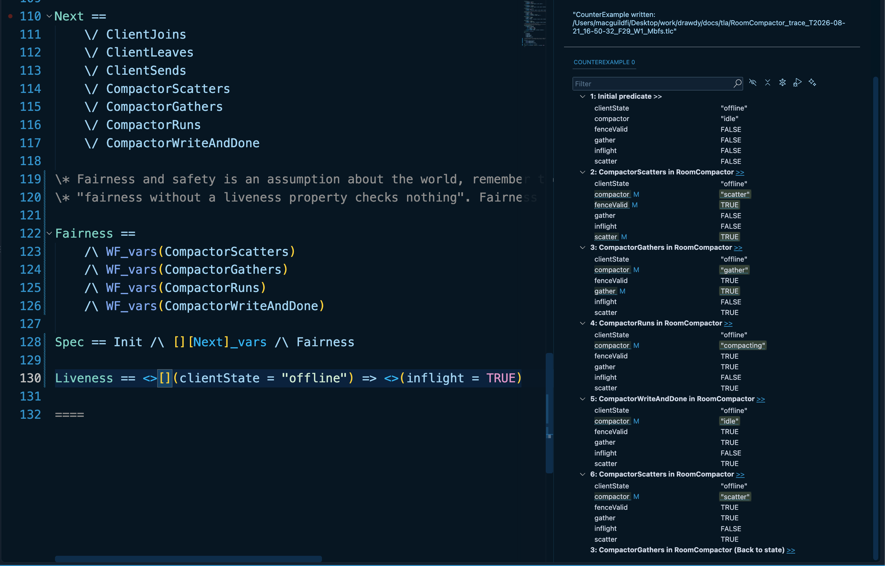

Take a look at .  Here, the correct liveness property is actually

```tla
Liveness == <>[](clientState = "offline") => <>(inflight = FALSE)
```

But in the image it's 

```tla
Liveness == <>[](clientState = "offline") => <>(inflight = TRUE)
```

because I wanted to force a counterexample to see how liveness check is failed. It failed once when stuttering step was detected before I could add weak fairness to filter out worlds. And it fails this time in the image from the loop it detected.

Taking a look at the loop, "[]"(always) property is checked when TLC finds a state in which the state is offline in all steps. Then it validates that inflgiht is TRUE at the end. So always eventually is telling TLC that when it finds a state that contains all "offline", inflight must be toggled true at some point.

But if we swap <> and [], we get

```tla
Liveness == []<>(clientState = "offline") => <>(inflight = TRUE)
```

This fails with 

This is another impossible state. We're saying that all lassos should contain cientState = "offline" and in there, inflgiht must be TRUE at some point.
